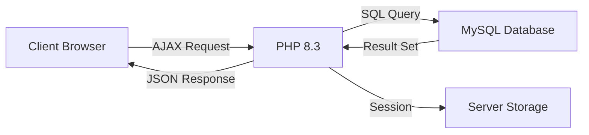

<div align="center">

# 🚌 Shikhare Travels
### Enterprise-Grade Online Bus Booking System

[](https://opensource.org/licenses/MIT)
[](https://shikharetravels.infinityfreeapp.com)
[](https://www.php.net)
[](https://www.mysql.com)
[](https://github.com/vijayshikhare/shikhare-travels)

**[Live Demo](https://shikharetravels.infinityfreeapp.com)** • **[Documentation](#documentation)** • **[Getting Started](#-quick-start)** • **[Contributing](#-contributing)**

</div>

---

## 📋 Table of Contents

- [Overview](#-overview)
- [Key Features](#-key-features)
- [Technology Stack](#-technology-stack)
- [Quick Start](#-quick-start)
- [Deployment Guide](#-deployment-guide)
- [Project Architecture](#-project-architecture)
- [Database Schema](#-database-schema)
- [Usage Guide](#-usage-guide)
- [Screenshots](#-screenshots)
- [Contributing](#-contributing)
- [License](#-license)
- [Contact](#-contact)

---

## 🎯 Overview

**Shikhare Travels** is a production-ready, full-featured bus ticket booking platform designed for travel agencies, startups, and educational purposes. Built with modern web technologies and best practices, it provides a seamless booking experience for users and comprehensive management tools for administrators.

### 🌟 Why Choose Shikhare Travels?

| Benefit | Description |
|---------|-------------|
| 💰 **Zero Cost** | Deploy on free hosting with no hidden charges |
| 🚀 **Production Ready** | Battle-tested with real users and transactions |
| 📱 **Mobile First** | Responsive design optimized for all devices |
| 🔒 **Secure** | Session-based authentication with input sanitization |
| 🎓 **Educational** | Perfect for learning full-stack development |
| 🛠️ **Customizable** | MIT licensed, open source, fully modifiable |

### 🎫 Demo Access

| Role | Username | Password | Access Level |
|------|----------|----------|--------------|
| 👨‍💼 **Admin** | `admin` | `admin` | Full system control |
| 👤 **User** | *Register new* | *Create password* | Booking & tickets |

---

## ✨ Key Features

### 👥 User Features

<table>
<tr>
<td width="50%">

#### 🔍 Search & Discovery
- Real-time bus search by route & date
- Live seat availability updates
- Dynamic fare calculation
- Multiple bus type filtering (AC/Non-AC)

</td>
<td width="50%">

#### 🎟️ Booking Management
- Book 1-10 seats in single transaction
- Instant booking confirmation
- E-ticket generation with QR code
- Print-ready ticket format

</td>
</tr>
<tr>
<td width="50%">

#### 👤 Profile Management
- Secure user registration
- Session-based authentication
- View booking history
- Manage personal information

</td>
<td width="50%">

#### 📱 User Experience
- AJAX-powered (no page reload)
- Flash notifications
- Mobile-responsive interface
- Intuitive navigation

</td>
</tr>
</table>

### 🛡️ Admin Features

<table>
<tr>
<td width="33%">

#### 🚌 Bus Management
- Add new buses
- Edit bus details
- Delete buses
- Manage routes & schedules

</td>
<td width="33%">

#### 📊 Analytics Dashboard
- Revenue tracking
- Booking statistics
- User analytics
- Occupancy reports

</td>
<td width="33%">

#### 👥 User Management
- View all users
- Monitor bookings
- Track transactions
- User activity logs

</td>
</tr>
</table>

---

## 🛠 Technology Stack

### Backend Architecture



### Core Technologies

| Layer | Technology | Purpose |
|-------|-----------|---------|
| **Frontend** | Bootstrap 5 | Responsive UI framework |
| **Scripting** | jQuery + Vanilla JS | AJAX & DOM manipulation |
| **Backend** | PHP 8.3+ | Server-side logic |
| **Database** | MySQL 8.0+ | Data persistence |
| **Hosting** | InfinityFree | Free cloud hosting |
| **Tools** | phpMyAdmin | Database management |

### Security Features

- ✅ Input validation & sanitization
- ✅ SQL injection prevention
- ✅ Session-based authentication
- ✅ Password hashing (recommended upgrade)
- ✅ HTTPS/SSL support

---

## 🚀 Quick Start

### Prerequisites

```bash
# Required Software
- XAMPP/WAMP/MAMP (PHP 8.3+, MySQL, Apache)
- Git (optional)
- Modern web browser
```

### Local Installation

#### Step 1: Clone Repository

```bash
# Using Git
git clone https://github.com/vijayshikhare/shikhare-travels.git
cd shikhare-travels

# Or download ZIP from GitHub
```

#### Step 2: Setup Database

```bash
1. Start XAMPP/WAMP services (Apache + MySQL)
2. Open phpMyAdmin: http://localhost/phpmyadmin
3. Create database: "transport"
4. Import: transport.sql
```

#### Step 3: Configure Database Connection

Edit `action.php` (lines 5-10):

```php
<?php
// Local Development Configuration
$con = mysqli_connect(
    "localhost",     // hostname
    "root",          // username
    "",              // password (empty for XAMPP)
    "transport"      // database name
);

if (!$con) {
    die("Connection failed: " . mysqli_connect_error());
}
?>
```

#### Step 4: Launch Application

```bash
# Open in browser
http://localhost/shikhare-travels

# Admin access
http://localhost/shikhare-travels/admin.php
```

### ✅ Verification Checklist

- [ ] Apache & MySQL services running
- [ ] Database imported successfully
- [ ] Homepage loads without errors
- [ ] User registration works
- [ ] Admin login successful
- [ ] Bus search returns results

---

## 🌐 Deployment Guide

### InfinityFree Hosting (Free)

#### Step 1: Create Account

1. Visit [infinityfree.com](https://infinityfree.com)
2. Sign up (free, no credit card)
3. Choose subdomain: `shikharetravels.infinityfreeapp.com`

#### Step 2: Upload Files

```bash
# Via File Manager (InfinityFree Control Panel)
1. Navigate to: /htdocs/
2. Delete default files (index.html, etc.)
3. Upload ALL project files directly to /htdocs/
   ⚠️ Don't create subfolder - upload files to root
```

#### Step 3: Setup Database

```sql
-- InfinityFree Control Panel > MySQL Databases
Database Name: if0_49_transport
Username: if0_7
Password: XrZA_your_password
Host: sql305.infinityfree.com
```

```bash
# Import Database
1. Open phpMyAdmin (link in control panel)
2. Select database: if0_49_transport
3. Import tab > Choose transport.sql
4. Click "Go"
```

#### Step 4: Update Configuration

Edit `action.php` for production:

```php
<?php
// Production Configuration (InfinityFree)
$con = mysqli_connect(
    'sql305.infinityfree.com',   // InfinityFree MySQL host
    'if0_7',                      // Your DB username
    'XrZA_your_password',         // Your DB password
    'if0_49_transport'            // Your DB name
);

if (!$con) {
    die("Connection failed: " . mysqli_connect_error());
}
?>
```

#### Step 5: Test Deployment

- ✅ Homepage: https://shikharetravels.infinityfreeapp.com
- ✅ Admin panel: https://shikharetravels.infinityfreeapp.com/admin.php
- ✅ User registration
- ✅ Booking flow
- ✅ E-ticket generation

### 🔧 Troubleshooting

| Issue | Solution |
|-------|----------|
| 404 Error | Ensure files are in `/htdocs/` not `/htdocs/subfolder/` |
| Database Error | Verify credentials in `action.php` match InfinityFree panel |
| Blank Page | Check PHP error logs in control panel |
| CSS Not Loading | Clear browser cache, check file paths |

---

## 📁 Project Architecture

```
shikhare-travels/
│
├── 📄 index.php                 # Landing page with search form
├── 📄 action.php                # Core backend logic (MVC Controller)
├── 📄 admin.php                 # Admin dashboard & management
├── 📄 profile.php               # User profile & booking history
├── 📄 print_ticket.php          # E-ticket generator with QR code
│
├── 📁 registration/
│   ├── login.php                # User authentication
│   ├── signup.php               # User registration
│   └── admin_login.php          # Admin authentication
│
├── 📁 css/
│   ├── style.css                # Custom styles
│   ├── print.css                # Print-specific styles
│   └── bootstrap.min.css        # Bootstrap framework
│
├── 📁 js/
│   ├── ajax.js                  # AJAX booking & search
│   ├── validation.js            # Form validation
│   └── jquery.min.js            # jQuery library
│
├── 📁 images/
│   ├── logo.png                 # Company logo
│   ├── icons/                   # UI icons
│   └── backgrounds/             # Visual assets
│
├── 📁 includes/
│   ├── header.php               # Common header
│   ├── footer.php               # Common footer
│   └── config.php               # Configuration file
│
├── 📄 transport.sql             # Database schema + sample data
├── 📄 README.md                 # This documentation
├── 📄 LICENSE                   # MIT License
└── 📄 .gitignore                # Git ignore rules
```

### Code Architecture

```
┌─────────────────────────────────────────┐
│         Presentation Layer              │
│  (HTML, CSS, Bootstrap, jQuery)         │
└─────────────────┬───────────────────────┘
                  │
┌─────────────────▼───────────────────────┐
│         Application Layer               │
│     (PHP Business Logic, AJAX)          │
└─────────────────┬───────────────────────┘
                  │
┌─────────────────▼───────────────────────┐
│          Data Layer                     │
│      (MySQL Database, Sessions)         │
└─────────────────────────────────────────┘
```

---

## 🗄 Database Schema

### Entity Relationship Diagram

```
┌──────────────┐       ┌──────────────┐       ┌──────────────┐
│  user_info   │       │    ticket    │       │ bus_details  │
├──────────────┤       ├──────────────┤       ├──────────────┤
│ uid (PK)     │◄──────┤ uid (FK)     │       │ bus_id (PK)  │
│ name         │       │ ticket_id(PK)│──────►│ bname        │
│ uname (UK)   │       │ bus_id (FK)  │       │ bno          │
│ psw          │       │ seat_no      │       │ bfrom        │
│ email        │       │ no_seat      │       │ bto          │
│ phone        │       │ total_fare   │       │ departure    │
│ age          │       │ jdate        │       │ fare         │
│ adhar_no     │       │ booking_date │       │ type         │
└──────────────┘       │ status       │       │ total_seats  │
                       └──────────────┘       └──────────────┘
```

### Table Specifications

#### 1. `user_info` - Customer Data

```sql
CREATE TABLE user_info (
    uid INT AUTO_INCREMENT PRIMARY KEY,
    name VARCHAR(100) NOT NULL,
    uname VARCHAR(50) UNIQUE NOT NULL,
    psw VARCHAR(255) NOT NULL,
    email VARCHAR(100) NOT NULL,
    phone VARCHAR(15) NOT NULL,
    age INT CHECK (age >= 18 AND age <= 100),
    adhar_no VARCHAR(12) UNIQUE,
    created_at TIMESTAMP DEFAULT CURRENT_TIMESTAMP,
    INDEX idx_uname (uname),
    INDEX idx_email (email)
);
```

#### 2. `admin` - Administrator Accounts

```sql
CREATE TABLE admin (
    a_id INT AUTO_INCREMENT PRIMARY KEY,
    name VARCHAR(50) NOT NULL,
    psw VARCHAR(255) NOT NULL,
    created_at TIMESTAMP DEFAULT CURRENT_TIMESTAMP
);

-- Default admin credentials
INSERT INTO admin (name, psw) VALUES ('admin', 'admin');
```

#### 3. `bus_details` - Fleet Management

```sql
CREATE TABLE bus_details (
    bus_id INT AUTO_INCREMENT PRIMARY KEY,
    bname VARCHAR(100) NOT NULL,
    bno VARCHAR(20) UNIQUE NOT NULL,
    bfrom VARCHAR(50) NOT NULL,
    bto VARCHAR(50) NOT NULL,
    departure_time TIME NOT NULL,
    fare DECIMAL(10,2) NOT NULL CHECK (fare > 0),
    type ENUM('AC', 'Non AC') NOT NULL,
    total_seats INT DEFAULT 40 CHECK (total_seats > 0),
    created_at TIMESTAMP DEFAULT CURRENT_TIMESTAMP,
    INDEX idx_route (bfrom, bto),
    INDEX idx_departure (departure_time)
);
```

#### 4. `ticket` - Booking Records

```sql
CREATE TABLE ticket (
    ticket_id INT AUTO_INCREMENT PRIMARY KEY,
    bus_id INT NOT NULL,
    uid INT NOT NULL,
    seat_no VARCHAR(100) NOT NULL,
    no_seat INT NOT NULL CHECK (no_seat > 0 AND no_seat <= 10),
    total_fare DECIMAL(10,2) NOT NULL,
    jdate DATE NOT NULL,
    booking_date DATETIME DEFAULT CURRENT_TIMESTAMP,
    ticket_status VARCHAR(20) DEFAULT 'confirmed',
    FOREIGN KEY (bus_id) REFERENCES bus_details(bus_id) ON DELETE CASCADE,
    FOREIGN KEY (uid) REFERENCES user_info(uid) ON DELETE CASCADE,
    INDEX idx_booking_date (booking_date),
    INDEX idx_journey_date (jdate)
);
```

### Sample Data

```sql
-- Sample buses
INSERT INTO bus_details (bname, bno, bfrom, bto, departure_time, fare, type, total_seats) 
VALUES 
('Shivneri Express', 'MH-12-AB-1234', 'Mumbai', 'Pune', '08:00:00', 350.00, 'AC', 40),
('Parivartan Travels', 'MH-14-CD-5678', 'Nagpur', 'Mumbai', '22:00:00', 800.00, 'AC', 45),
('Janta Express', 'MH-20-EF-9012', 'Pune', 'Nashik', '06:30:00', 250.00, 'Non AC', 40);
```

---

## 📖 Usage Guide

### For End Users

#### 1️⃣ Registration & Login

```
Step 1: Visit homepage
Step 2: Click "Sign Up"
Step 3: Fill registration form
        - Full Name
        - Username (unique)
        - Password (min 6 chars)
        - Email & Phone
        - Age (18+)
        - Aadhaar Number
Step 4: Submit → Auto-login
```

#### 2️⃣ Search & Book Buses

```
Step 1: Enter journey details
        - From City
        - To City
        - Journey Date
Step 2: Click "Search Buses"
Step 3: View available buses with:
        - Departure time
        - Fare per seat
        - Available seats
        - Bus type (AC/Non-AC)
Step 4: Click "Book Now"
Step 5: Select number of seats (1-10)
Step 6: Confirm booking
Step 7: Receive ticket confirmation
```

#### 3️⃣ View & Print E-Tickets

```
Step 1: Login to profile
Step 2: Navigate to "My Tickets"
Step 3: View booking history
Step 4: Click "Print Ticket"
Step 5: E-ticket with QR code opens
Step 6: Print or save as PDF
```

### For Administrators

#### 🔐 Admin Access

```
URL: /admin.php
Username: admin
Password: admin
```

#### 🚌 Add New Bus

```
Step 1: Admin Dashboard → "Add Bus"
Step 2: Enter bus details:
        - Bus Name
        - Registration Number
        - Route (From → To)
        - Departure Time
        - Fare per Seat
        - Type (AC/Non-AC)
        - Total Seats
Step 3: Submit → Bus active
```

#### 📊 View Analytics

```
Dashboard Metrics:
- Total Bookings Today
- Revenue This Month
- Active Users
- Buses in Fleet
- Occupancy Rate
- Top Routes
```

#### 👥 Manage Users & Bookings

```
View All Users:
- User details
- Registration date
- Total bookings
- Contact info

View All Bookings:
- Ticket ID
- User name
- Bus details
- Journey date
- Payment status
- Booking date
```

---

## 📸 Screenshots

### User Interface

| Homepage | Search Results |
|----------|----------------|
|  |  |

| Booking Flow | E-Ticket |
|--------------|----------|
|  |  |

### Admin Panel

| Dashboard | Bus Management |
|-----------|----------------|
|  |  |

---

## 🤝 Contributing

We welcome contributions from the community! Here's how you can help:

### Contribution Process

```bash
# 1. Fork the repository
Click "Fork" on GitHub

# 2. Clone your fork
git clone https://github.com/YOUR_USERNAME/shikhare-travels.git
cd shikhare-travels

# 3. Create feature branch
git checkout -b feature/amazing-feature

# 4. Make changes and commit
git add .
git commit -m "Add amazing feature"

# 5. Push to your fork
git push origin feature/amazing-feature

# 6. Open Pull Request
Go to GitHub and create PR
```

### Development Guidelines

#### Code Standards

- ✅ Use **Bootstrap 5** classes for styling
- ✅ Sanitize **all user inputs** with `mysqli_real_escape_string()`
- ✅ Follow **PSR-12** PHP coding standards
- ✅ Write **descriptive commit messages**
- ✅ Add **inline comments** for complex logic
- ✅ Test on **InfinityFree** before submitting PR

#### Security Checklist

- [ ] Input validation implemented
- [ ] SQL injection prevention
- [ ] XSS protection added
- [ ] Session management secure
- [ ] Password hashing used (bcrypt recommended)

### Areas for Contribution

| Priority | Feature | Difficulty |
|----------|---------|------------|
| 🔥 High | Payment Gateway Integration | Medium |
| 🔥 High | Email Notifications | Easy |
| 🔴 Medium | SMS Alerts | Medium |
| 🔴 Medium | Advanced Search Filters | Easy |
| 🟡 Low | Multi-language Support | Hard |
| 🟡 Low | Mobile App (React Native) | Hard |

---

## 📄 License

This project is licensed under the **MIT License** - see the [LICENSE](LICENSE) file for details.

```
MIT License

Copyright (c) 2025 Vijay Shikhare

Permission is hereby granted, free of charge, to any person obtaining a copy
of this software and associated documentation files (the "Software"), to deal
in the Software without restriction, including without limitation the rights
to use, copy, modify, merge, publish, distribute, sublicense, and/or sell
copies of the Software...
```

**TL;DR**: Free to use, modify, and distribute. No warranty provided.

---

## 🙏 Acknowledgments

- **Bootstrap Team** - For the amazing UI framework
- **jQuery Foundation** - For simplifying JavaScript
- **InfinityFree** - For free, reliable hosting
- **Open Source Community** - For inspiration and support
- **Early Adopters** - For valuable feedback

---

## 📞 Contact

<div align="center">

### Vijay Shikhare
**Full-Stack Developer | PHP Specialist | Open Source Enthusiast**

[](mailto:vijayshikhareteam@gmail.com)
[](https://linkedin.com/in/vijayshikhare)
[](https://github.com/vijayshikhare)
[](https://shikharetravels.infinityfreeapp.com)

</div>

---

## 🏷️ Keywords & Tags

### SEO Keywords
```
bus booking system, online bus ticket booking, php bus reservation, mysql booking system,
free bus booking software, open source ticketing system, travel booking php project,
e-ticket generation, qr code ticket, infinityfree hosting project, bootstrap bus booking,
ajax bus search, admin panel php, responsive booking system, php mysql project
```

### GitHub Topics
`php` `mysql` `bootstrap` `jquery` `ajax` `bus-booking` `ticket-booking` `e-ticket` 
`qr-code` `admin-panel` `responsive-design` `infinityfree` `open-source` `mit-license`
`full-stack` `web-development` `travel-agency` `booking-system` `reservation-system`

---

<div align="center">

### ⭐ Star this repository if you find it helpful!

**Made with ❤️ by Vijay Shikhare**  
*Last Updated: November 12, 2025*

[](https://github.com/vijayshikhare)
[](https://github.com/vijayshikhare/shikhare-travels)
[](https://github.com/vijayshikhare/shikhare-travels/fork)
[](https://github.com/vijayshikhare/shikhare-travels)

</div>
